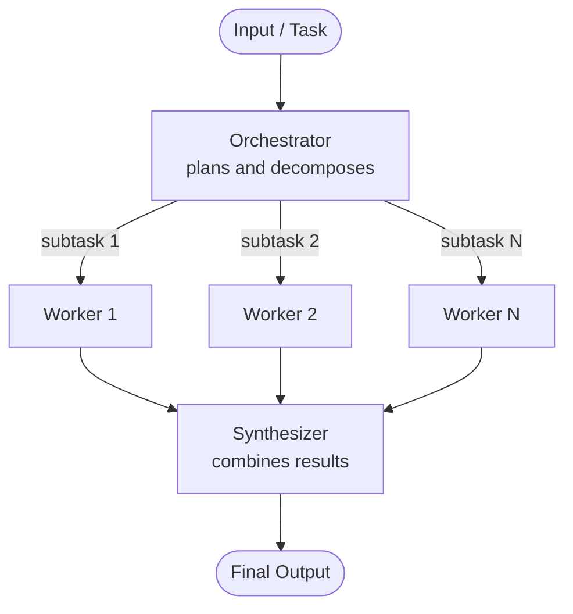

# Orchestrator-Worker Architecture

## 1. Overview

In the **orchestrator-workers workflow**, a central LLM dynamically breaks down tasks, delegates them to worker LLMs, and synthesizes their results.

An **orchestrator (lead agent)** does three things:

1. **Decomposes** a task into subtasks
2. **Delegates** each subtask to a worker
3. **Synthesizes** the workers' results into one final output

That's it. Whether the workers are created on the fly or exist beforehand is a separate design choice (see [Section 4](#4-two-ways-to-implement-it)).

---

## 2. When to Use This Workflow

This workflow is well-suited for **complex tasks where you can't predict the subtasks needed**.

**Example (coding):** the number of files that need to be changed, and the nature of the change in each file, likely depend on the task. You can't hardcode that in advance.

### Key difference from parallelization

The two patterns look the same on a diagram, but they differ in *who decides the subtasks*.

| | Parallelization | Orchestrator-Worker |
|---|---|---|
| Topology | Fan-out → fan-in | Fan-out → fan-in (topographically similar) |
| Subtasks | **Pre-defined** (fixed branches) | **Determined at runtime** by the orchestrator from the specific input |
| Flexibility | Low | **High** |
| Number of branches | Known at design time | Unknown until the orchestrator plans |

> **Rule of thumb:** if you can write down the list of branches before seeing the input, use parallelization. If the input decides the branches, use orchestrator-worker.

---

## 3. Architecture Diagram




**Roles at a glance**

| Component | Responsibility |
|---|---|
| Orchestrator (lead agent) | Understands the task, decides the subtasks and how many, writes or selects instructions for each worker |
| Workers | Execute one focused subtask each, with their own prompt, tools, and scope |
| Synthesizer | Merges worker outputs into one coherent result (can be the orchestrator itself or a separate node) |

---

## 4. Two Ways to Implement It

### 4.1 Static (predefined) workers

You define a **fixed roster of specialized workers** up front, each with its own prompt, tools, and scope.

- Example roster: a **"SQL analyst,"** a **"report writer,"** and a **"validator."**
- The orchestrator decides **which** workers to invoke and with **what input**.
- The set of worker *types* does **not** change at runtime.
- This is the **more predictable and testable** option, and it's what **most production systems use**.

### 4.2 Dynamic workers

The orchestrator decides **at runtime how many workers to spawn and what each one does**, writing the instructions for each subtask itself.

- Fits **open-ended problems** where you can't know the subtasks in advance.
- Typical case: **broad research**, where the lead agent spins up *N* parallel researchers depending on how the question breaks down.
- **Anthropic's multi-agent research system** is the well-known example.

### 4.3 Side-by-side comparison

| Aspect | Static workers | Dynamic workers |
|---|---|---|
| Worker types | Fixed at design time | Defined by the orchestrator at runtime |
| Worker count | Chosen by orchestrator, from known types | Chosen by orchestrator, unbounded unless capped |
| Worker instructions | Written by you (fixed prompts) | Written by the orchestrator per subtask |
| Predictability | High | Lower |
| Testing / evaluation | Easier (test each worker in isolation) | Harder (behavior varies per input) |
| Cost | More predictable, usually cheaper | Can grow with problem breadth |
| Control over tools/permissions | Tight, per worker type | Looser, needs guardrails |
| Best for | Known, repeatable task structure | Open-ended, variable-breadth problems |

### 4.4 The middle path

A common hybrid: **a static set of worker types, with the orchestrator spawning a dynamic number of instances of each.**

*Example:* three worker types exist (`sql_analyst`, `report_writer`, `validator`), but the orchestrator decides it needs four `sql_analyst` instances for this input and one of each of the others.

---

## 5. What Actually Distinguishes the Pattern

The key trait: **the subtasks are determined by the orchestrator at runtime based on the input**, as opposed to being hardcoded in advance.

- Hardcoded steps → that's plain **prompt chaining**.
- Hardcoded parallel branches → that's plain **parallelization**.
- **Even with static worker types**, the orchestrator is still choosing *what* to delegate and *how many times*. That is why it still counts as orchestrator-worker.

---

## 6. How to Choose

| Situation | Choice | Why |
|---|---|---|
| Task structure is **known and repeatable** | **Static workers** | Cheaper, easier to evaluate, tighter control over tools and permissions |
| Task structure is **unpredictable or varies widely in breadth** | **Dynamic spawning**, with guardrails | Subtasks can't be known up front |
| Mostly known types, variable volume | **Middle path** | Fixed worker quality, flexible fan-out |

### Guardrails for dynamic spawning

1. **Cap the worker count.** Set a hard maximum so a bad plan can't spawn hundreds of workers.
2. **Define clear subtask boundaries.** Each subtask should have a distinct scope and a stated output.
3. **Give explicit instructions** so workers don't duplicate each other's effort (state what the *other* workers are covering).

---

## 7. Related Patterns

| Pattern | Subtasks decided by | Typical use |
|---|---|---|
| Prompt chaining | You (fixed sequence) | Steps are fixed and ordered |
| Routing | A classifier picks **one** path | Different input types need different handlers |
| Parallelization | You (fixed branches) | Independent checks, voting, fixed sections |
| **Orchestrator-worker** | **The orchestrator, per input** | Unpredictable decomposition |
| Evaluator-optimizer | Loop: generate → critique → refine | Quality refinement against clear criteria |

These combine well. For example, each worker can be a prompt chain, or a validator worker can run an evaluator-optimizer loop.

---

## 8. Implementation in LangGraph

The report-generation example uses the following flow:

```
START → plan_report → [write_section × N in parallel] → assemble_report → END
```

### 8.1 Building blocks

| Piece | Role |
|---|---|
| Structured-output planner (`llm.with_structured_output(ReportPlan)`) | Forces the orchestrator to return a machine-readable list of sections |
| `Send` API | Fan-out: launches one worker per section with its own private input |
| Reducer (`Annotated[list, operator.add]`) | Merges all parallel worker outputs instead of overwriting |
| Superstep join | `assemble_report` runs only after all workers finish |

### 8.2 How worker output flows into the main state

This is the most commonly misunderstood part.

1. **Input side:** `Send("write_section", {"section": s, "section_index": i})` gives each worker a **private payload**. The worker's input schema (`SectionWorkerState`) describes only that payload.
2. **Output side:** each worker **returns a partial update** (for example `{"completed_sections": [item]}`). LangGraph applies it to the channels defined by the **parent `ReportState`**.
3. **Merge:** because `completed_sections` is declared in `ReportState` with `operator.add`, the lists from all workers are **concatenated**.
4. **Join:** all parallel workers run in the same superstep, their updates are merged, and only then does the synthesizer run.

```
Send(...)  ──►  worker input   (SectionWorkerState: private, per worker)
worker returns {"completed_sections": [...]}  ──►  ReportState channels (shared, with reducer)
```

**Key points**

- A worker does not write into the state directly. It **returns an update**, and LangGraph applies it.
- `SectionWorkerState` is an **input schema only**. It does not need to declare `completed_sections`.
- The key a worker returns must exist in the parent state **with a reducer**, and whatever reads the result must use the same key.
- The worker must return a **list** (`[item]`), because `operator.add` concatenates list + list.
- The worker only sees what you put in `Send`. If it needs `topic` or other state, add it to the payload and to the worker's input schema.

### 8.3 Core code

```python
import operator
from typing import Annotated, List, TypedDict
from langgraph.constants import Send


class ReportState(TypedDict):
    topic: str
    sections: List[ReportSection]
    # Reducer: merge parallel worker outputs by list concatenation
    completed_sections: Annotated[List[CompletedSection], operator.add]
    final_report: str


class SectionWorkerState(TypedDict):
    section: ReportSection      # private input for one worker
    section_index: int


def assign_section_writers(state: ReportState):
    # One worker per planned section: the count is decided at runtime
    return [
        Send("write_section", {"section": s, "section_index": i})
        for i, s in enumerate(state["sections"])
    ]
```

The full runnable version is in `orchestrator_worker_report.py`.

### 8.4 Mapping the pattern to LangGraph

| Pattern concept | LangGraph mechanism |
|---|---|
| Orchestrator | A node that calls a structured-output LLM |
| Dynamic workers | Conditional edge returning a list of `Send` objects |
| Static workers | Conditional edge routing to a fixed set of named nodes |
| Middle path | `Send` to fixed worker node names, with a variable number of `Send` calls per type |
| Synthesizer | A node downstream of the workers, reading the reduced channel |

---

## 9. Pitfalls and Best Practices

### Common pitfalls

| Pitfall | What happens | Fix |
|---|---|---|
| **Missing reducer** on the shared key | Concurrent writes raise an `InvalidUpdateError`, or only one worker's output survives | Declare `Annotated[list, operator.add]` on the parent state |
| **Returning a string instead of a list** | Reducer fails or concatenates incorrectly | Always return `[value]` |
| **Renaming the key only in the worker's return** | Worker writes to a channel the synthesizer never reads, so the final report is silently empty | Keep the returned key identical to the key in the parent state |
| **Assuming ordered results** | Output order follows completion time, not plan order | Return an index with each result and sort in the synthesizer |
| **Workers lack context** | Workers produce generic or inconsistent output | Pass needed context (topic, style guide, neighboring sections) in the `Send` payload |
| **Runaway fan-out** | Cost and latency explode | Cap worker count and concurrency |
| **Duplicate work across workers** | Overlapping sections, wasted tokens | Give workers distinct scopes and tell each what others cover |

### Best practices

1. **Use structured output for the plan.** A schema-validated plan is far more reliable than parsing free text.
2. **Cap the plan size.** Truncate or reject plans above a limit (for example `sections[:MAX_SECTIONS]`).
3. **Limit concurrency.** Pass `config={"max_concurrency": N}` when invoking the graph to avoid rate-limit spikes.
4. **Keep worker prompts narrow.** One subtask, one output format, no side quests.
5. **Add a synthesis quality step.** The synthesizer can also de-duplicate, harmonize tone, and fix transitions, not just concatenate.
6. **Validate before returning.** A validator worker or node can check completeness against the original plan.
7. **Handle partial failure.** Decide up front whether one failed worker should fail the whole run, retry, or be skipped and flagged.
8. **Trace everything.** Log the plan, each worker's input and output, and token usage per worker (for example with LangSmith or an equivalent).
9. **Evaluate the orchestrator separately from the workers.** Plan quality and section quality fail in different ways.

---

## 10. Trade-offs

| Advantages | Disadvantages |
|---|---|
| Handles problems whose shape isn't known in advance | Higher cost and latency than a single call or a fixed chain |
| Workers run in parallel, so wall-clock time is lower than sequential | Plan quality is a single point of failure |
| Each worker gets a focused context, which often improves quality | Workers can lack global context and produce inconsistent results |
| Easy to scale breadth (more subtasks, same graph) | Harder to test and debug than fixed workflows |
| Clean separation of planning and execution | Synthesis can lose detail or introduce contradictions |

**Use it when** the complexity of the task justifies the added cost. For simple or fully predictable tasks, a single prompt, a prompt chain, or fixed parallelization is usually better.

---

## 11. Example Use Cases

| Use case | Orchestrator decides | Workers do |
|---|---|---|
| **Multi-file code changes** | Which files need edits and what each edit is | Modify one file each |
| **Broad research** | How to split the question into angles | Each researches one angle (dynamic workers) |
| **Long report generation** | The section outline | Each writes one section (the example in this document) |
| **Data pipeline or report migration** | Which assets need migrating and in what groups | Each converts or validates one asset group |
| **Document analysis at scale** | How to partition and what to extract | Each processes one partition |
| **Production analytics assistant** | Which specialist is needed for the question | `sql_analyst`, `report_writer`, `validator` (static roster) |

---

## 12. Quick Decision Checklist

- [ ] Can I list the subtasks before seeing the input? **Yes → use parallelization or chaining instead.**
- [ ] Does the input determine how many subtasks exist and what they are? **Yes → orchestrator-worker.**
- [ ] Is the task structure repeatable and the worker types known? **Use static workers.**
- [ ] Is the breadth unpredictable? **Use dynamic workers, with a worker cap, clear boundaries, and explicit anti-duplication instructions.**
- [ ] Mostly known types but variable volume? **Use the middle path.**
- [ ] Do I have a reducer on every shared key written by parallel workers? **Required.**
- [ ] Do I need ordered output? **Return an index and sort in the synthesizer.**

---

## 13. Summary

- **Orchestrator-worker** = one lead LLM **decomposes**, **delegates**, and **synthesizes**.
- Its defining trait is that **the orchestrator determines the subtasks at runtime from the input**. That separates it from fixed parallelization and prompt chaining.
- **Static workers** (fixed roster) are more predictable, testable, and common in production. **Dynamic workers** (spawned at runtime) suit open-ended problems and need guardrails.
- A **hybrid** (fixed worker types, dynamic instance counts) is common.
- In **LangGraph**, `Send` handles the fan-out, a **reducer** on the parent state merges worker outputs, and the **superstep join** ensures the synthesizer sees everything.
- Workers **return updates** that LangGraph applies to the parent state's channels. They do not write to it directly.