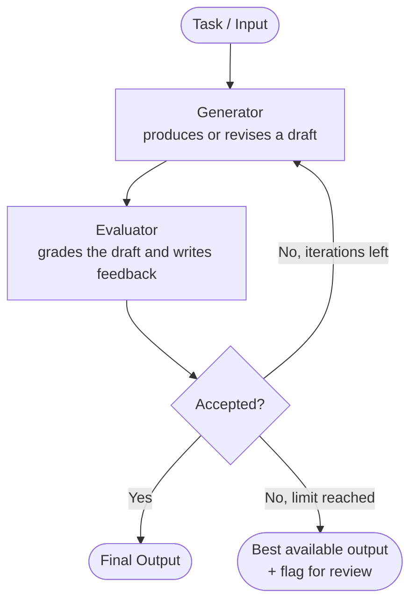

# Evaluator-Optimizer Architecture

## 1. Overview

In the **evaluator-optimizer workflow**, one LLM call **generates** a response while another LLM call **evaluates** it and provides feedback, **in a loop**. The generator revises its output using that feedback, and the loop repeats until the evaluator accepts the result or a stopping limit is reached.

It mirrors how a human writer works: draft, get feedback from an editor, revise, and repeat until it is good enough.

The two roles:

| Role | Also called | Responsibility |
|---|---|---|
| **Generator** | Optimizer, producer, writer | Produces the first response, then improves it using the evaluator's feedback |
| **Evaluator** | Critic, judge, reviewer | Scores or grades the response against criteria and returns **actionable feedback** |

A third element is not an LLM at all: the **loop controller**, which decides whether to accept, revise again, or stop.

---

## 2. When to Use This Workflow

This workflow is particularly effective when **both** of the following hold.

1. **There are clear evaluation criteria.** You (or the evaluator) can say what "good" looks like: a rubric, a test suite, a schema, a style guide, a target.
2. **Iterative refinement provides measurable value.** The first attempt is usually not good enough, and revising against feedback measurably improves it.

### Two signs of a good fit

- **Responses can be demonstrably improved when a human articulates feedback.** If a person saying "this is too vague in paragraph two" leads to a better draft, then feedback-driven revision works for this task.
- **The LLM can provide that kind of feedback itself.** If a model can reliably spot the same problems a human reviewer would, the human can be replaced by an evaluator in the loop.

If either sign is missing, the loop tends to burn tokens without improving the output.

### Key difference from other workflows

| | Prompt chaining | Parallelization | Orchestrator-worker | **Evaluator-optimizer** |
|---|---|---|---|---|
| Control flow | Fixed sequence, one pass | Fixed branches, one pass | Planned fan-out, one pass | **Loop with a feedback cycle** |
| Number of LLM calls | Known | Known | Decided by the orchestrator | **Variable (depends on how many rounds are needed)** |
| Quality mechanism | Step ordering | Voting or sectioning | Specialization | **Critique and revision** |
| Termination | Last step | All branches done | Synthesis done | **Evaluator accepts, or a limit is hit** |

> **Rule of thumb:** if the work is correct after one well-prompted pass, you don't need this pattern. If a single pass is often wrong and you can describe *why* it is wrong, you do.

---

## 3. Architecture Diagram



**The loop in words**

1. The generator produces a draft from the task.
2. The evaluator grades the draft against the criteria and returns a verdict plus feedback.
3. If the verdict is **pass**, the draft is returned.
4. If the verdict is **revise**, the feedback goes back to the generator, which produces an improved draft.
5. If the **iteration limit** is reached first, the loop stops and returns the best draft so far, ideally flagged for review.

---

## 4. Ways to Implement the Evaluator

The evaluator is the part that decides whether the pattern works. There are several designs.

| Evaluator type | How it works | Strengths | Weaknesses |
|---|---|---|---|
| **LLM-as-judge (rubric)** | An LLM grades against explicit criteria and writes feedback | Flexible, handles subjective quality | Can be lenient or inconsistent, needs a good rubric |
| **Programmatic / deterministic** | Unit tests, linter, compiler, schema validation, query execution, regex checks | Objective, cheap, reproducible | Only covers what can be checked mechanically |
| **Hybrid** | Deterministic checks first, then an LLM judge for what remains | Cheap failures caught early, nuance still covered | More moving parts |
| **Human-in-the-loop** | A person reviews and gives feedback at some or all rounds | Highest trust for high-stakes output | Slow, doesn't scale |
| **Multi-evaluator panel** | Several evaluators (for example accuracy, tone, compliance) run in parallel and their feedback is merged | Covers multiple criteria independently | Higher cost, needs a merge rule |
| **Self-refine** | The same model critiques and revises its own output | Simplest to set up | Weakest: a model tends to approve its own work |

### Evaluator output should be structured

A good evaluator returns more than "good" or "bad":

- **Verdict:** `pass` or `revise` (a machine-readable decision for the loop controller)
- **Feedback:** specific, actionable, and tied to the criteria ("The second paragraph states a figure without a source; add one or remove the claim")
- **Optionally a score** per criterion, which helps detect whether revisions are actually improving the output

---

## 5. Stopping Conditions

A loop without a reliable exit is the main risk of this pattern. Combine several conditions.

| Condition | Description |
|---|---|
| **Acceptance** | The evaluator returns `pass` |
| **Maximum iterations** | A hard cap (commonly 2 to 5 rounds). This is **mandatory** |
| **Plateau** | The score stops improving between rounds, so more loops won't help |
| **Budget** | Token, cost, or time limit reached |
| **Human escalation** | After N failures, route to a person instead of looping further |

Always decide in advance what to return when the loop ends **without** acceptance: the last draft, the best-scoring draft, or an error or flag for review.

---

## 6. How to Choose

| Situation | Choice | Why |
|---|---|---|
| Single pass is reliably good enough | **Skip the loop** | Extra rounds only add cost and latency |
| Quality is checkable by code (tests, schema, query execution) | **Evaluator-optimizer with a programmatic evaluator** | Objective feedback, cheapest, most reliable |
| Quality is subjective but can be expressed as a rubric | **Evaluator-optimizer with an LLM judge** | Flexible, but invest in the rubric |
| Output is high-stakes (legal, financial, customer-facing) | **Add a human reviewer in the loop** | Automated evaluators can miss critical errors |
| Criteria are vague ("make it better") | **Fix the criteria first** | A loop with no clear target oscillates |
| Several independent quality dimensions | **Multi-evaluator panel** | Each evaluator stays focused |

---

## 7. Related Patterns

| Pattern | Relationship |
|---|---|
| **Prompt chaining** | A chain can end with one evaluator step, but it doesn't loop back |
| **Parallelization (voting)** | Several attempts are compared at once, rather than one attempt refined over time |
| **Orchestrator-worker** | A validator worker can run an evaluator-optimizer loop on each worker's output |
| **Reflection / self-refine** | The same idea where the generator and evaluator are the same model |
| **Agents with tool feedback** | An agent that runs tests and fixes failures is effectively an evaluator-optimizer with a programmatic evaluator |

These combine well. A common production shape is **orchestrator-worker for decomposition, with an evaluator-optimizer loop wrapped around each worker or around the final synthesis**.

---

## 8. Implementation in LangGraph

The example below drafts a piece of text, evaluates it against a rubric, and loops until it passes or reaches a maximum number of rounds.

```
START → generate_draft → evaluate_draft ──► (pass or limit reached) → finalize_output → END
                ▲                       │
                └──── (revise) ─────────┘
```

### 8.1 Building blocks

| Piece | Role |
|---|---|
| Structured-output evaluator (`llm.with_structured_output(EvaluationResult)`) | Forces a machine-readable verdict plus feedback |
| State fields `draft`, `feedback`, `verdict`, `iteration` | Carry the loop's data between rounds |
| Conditional edge (`route_after_evaluation`) | The loop controller: accept, revise, or stop |
| `max_iterations` guard | Hard exit so the loop cannot run forever |
| Reducer on `history` (`operator.add`) | Keeps an audit trail of every round |

### 8.2 How the loop works in the graph

- Unlike the orchestrator-worker graph, there is **no fan-out and no reducer needed for correctness**. Each node runs **once per round**, and its returned update **overwrites** the matching state key (`draft`, `feedback`, `verdict`).
- The loop is created by a **conditional edge that points back** to `generate_draft`.
- The `iteration` counter lives in state and is incremented by the generator node. The router reads it to enforce the cap.
- `history` uses `operator.add` only because it is an append-only log. Without the reducer, each round would overwrite the previous entry.

### 8.3 Full code

```python
import operator
from typing import Annotated, List, Literal, TypedDict

from langchain_core.messages import HumanMessage, SystemMessage
from langgraph.graph import END, START, StateGraph
from pydantic import BaseModel, Field

# NOTE: `llm` is assumed to be an already-initialised chat model, e.g.
#   from langchain_openai import AzureChatOpenAI
#   llm = AzureChatOpenAI(...)

# --------------------------------------------------------------------------- #
# Evaluator output schema
# --------------------------------------------------------------------------- #
class EvaluationResult(BaseModel):
    """Structured result returned by the evaluator."""

    verdict: Literal["pass", "revise"] = Field(
        description="'pass' if the draft meets ALL criteria, otherwise 'revise'"
    )
    feedback: str = Field(
        description="Specific, actionable feedback tied to the criteria. "
        "Empty or brief if the verdict is 'pass'."
    )


# LLM forced to answer in the `EvaluationResult` shape.
# Consider a separate (or stronger) model here to reduce self-approval bias.
evaluator_llm = llm.with_structured_output(EvaluationResult)

# Rubric used by the evaluator. Keep criteria explicit and checkable.
EVALUATION_CRITERIA = """
1. Directly answers the task, with no off-topic content.
2. Every factual claim is specific; no vague generalities.
3. Clear structure with a logical flow.
4. Concise: no repetition or filler.
"""


# --------------------------------------------------------------------------- #
# Graph state
# --------------------------------------------------------------------------- #
class RoundRecord(TypedDict):
    """Audit record for one generate-evaluate round."""

    iteration: int
    verdict: str
    feedback: str


class RefinementState(TypedDict):
    """Shared graph state for the generate-evaluate loop."""

    task: str                  # What the user wants produced
    draft: str                 # Latest draft (overwritten each round)
    feedback: str              # Latest evaluator feedback (overwritten each round)
    verdict: str               # Latest verdict: "pass" or "revise"
    iteration: int             # Number of drafts generated so far
    max_iterations: int        # Hard cap on rounds
    # Append-only log across rounds; `operator.add` concatenates the lists
    history: Annotated[List[RoundRecord], operator.add]
    final_output: str          # Result returned to the caller
    stop_reason: str           # "accepted" or "max_iterations_reached"


# --------------------------------------------------------------------------- #
# Nodes
# --------------------------------------------------------------------------- #
def generate_draft(state: RefinementState) -> dict:
    """Generator: write the first draft, or revise using the latest feedback."""
    if state.get("feedback"):
        # Revision round: give the generator the previous draft and the feedback
        prompt = (
            f"Task: {state['task']}\n\n"
            f"Previous draft:\n{state['draft']}\n\n"
            f"Evaluator feedback:\n{state['feedback']}\n\n"
            "Rewrite the draft so it addresses ALL of the feedback."
        )
    else:
        # First round: no feedback yet
        prompt = f"Task: {state['task']}\n\nWrite the best possible response."

    response = llm.invoke(
        [
            SystemMessage(content="You are a careful writer. Return only the draft."),
            HumanMessage(content=prompt),
        ]
    )

    return {
        "draft": response.content,
        "iteration": state.get("iteration", 0) + 1,
    }


def evaluate_draft(state: RefinementState) -> dict:
    """Evaluator: grade the latest draft against the criteria."""
    result = evaluator_llm.invoke(
        [
            SystemMessage(
                content=(
                    "You are a strict reviewer. Grade the draft against the "
                    "criteria below. Return 'pass' only if ALL criteria are met. "
                    "Otherwise return 'revise' with specific, actionable feedback."
                    f"\n\nCriteria:\n{EVALUATION_CRITERIA}"
                )
            ),
            HumanMessage(
                content=f"Task: {state['task']}\n\nDraft:\n{state['draft']}"
            ),
        ]
    )

    print(f"Round {state['iteration']}: {result.verdict}")

    return {
        "verdict": result.verdict,
        "feedback": result.feedback,
        # List value, so the `operator.add` reducer appends it to the history
        "history": [
            {
                "iteration": state["iteration"],
                "verdict": result.verdict,
                "feedback": result.feedback,
            }
        ],
    }


def route_after_evaluation(state: RefinementState) -> Literal["finalize_output", "generate_draft"]:
    """Loop controller: accept, stop at the cap, or send back for revision."""
    if state["verdict"] == "pass":
        return "finalize_output"
    if state["iteration"] >= state["max_iterations"]:
        return "finalize_output"  # Cap reached: stop and flag it in finalize_output
    return "generate_draft"


def finalize_output(state: RefinementState) -> dict:
    """Package the result and record why the loop stopped."""
    accepted = state["verdict"] == "pass"
    return {
        "final_output": state["draft"],
        "stop_reason": "accepted" if accepted else "max_iterations_reached",
    }


# --------------------------------------------------------------------------- #
# Build and compile the graph
# --------------------------------------------------------------------------- #
refinement_graph_builder = StateGraph(RefinementState)

refinement_graph_builder.add_node("generate_draft", generate_draft)
refinement_graph_builder.add_node("evaluate_draft", evaluate_draft)
refinement_graph_builder.add_node("finalize_output", finalize_output)

refinement_graph_builder.add_edge(START, "generate_draft")
refinement_graph_builder.add_edge("generate_draft", "evaluate_draft")
refinement_graph_builder.add_conditional_edges(
    "evaluate_draft",
    route_after_evaluation,
    {
        "finalize_output": "finalize_output",
        "generate_draft": "generate_draft",  # The loop-back edge
    },
)
refinement_graph_builder.add_edge("finalize_output", END)

refinement_graph = refinement_graph_builder.compile()


# --------------------------------------------------------------------------- #
# Usage
# --------------------------------------------------------------------------- #
if __name__ == "__main__":
    result = refinement_graph.invoke(
        {
            "task": "Explain the difference between a clustered and a "
                    "non-clustered index in SQL Server in under 150 words.",
            "iteration": 0,
            "max_iterations": 3,
            "feedback": "",
            "history": [],
        }
    )

    print("Stop reason:", result["stop_reason"])
    print("Rounds used:", result["iteration"])
    print(result["final_output"])
```

### 8.4 Mapping the pattern to LangGraph

| Pattern concept | LangGraph mechanism |
|---|---|
| Generator | A node that calls the LLM with the task, and the previous draft plus feedback on later rounds |
| Evaluator | A node that calls a structured-output LLM (or runs tests, a linter, or a validator) |
| Loop controller | A conditional edge function returning the next node name |
| Loop | A conditional edge that routes back to the generator node |
| Iteration cap | A counter in state, checked in the router |
| Audit trail | A state key with the `operator.add` reducer |
| Safety net | The graph's `recursion_limit` config, as a backstop behind the iteration cap (check the default in your LangGraph version) |

---

## 9. Pitfalls and Best Practices

### Common pitfalls

| Pitfall | What happens | Fix |
|---|---|---|
| **No iteration cap** | The loop can run indefinitely and burn cost | Always enforce `max_iterations` in the router |
| **Vague criteria** | The evaluator moves the goalposts each round, so the draft oscillates | Write explicit, checkable criteria |
| **Lenient evaluator (self-approval)** | The evaluator passes weak drafts, especially when it is the same model and prompt as the generator | Use a stricter prompt, a different or stronger model, or deterministic checks |
| **Overly harsh evaluator** | Nothing ever passes, so every run hits the cap | Calibrate the rubric on known good and bad examples |
| **Non-actionable feedback** | "Make it better" gives the generator nothing to act on | Require specific, criteria-linked feedback in the evaluator prompt and schema |
| **Generator ignores feedback** | The same flaws reappear | Put the feedback prominently in the revision prompt and tell the generator to address every point |
| **Regression** | A later draft is worse than an earlier one | Track scores and keep the best draft, not just the last |
| **Oscillation** | The draft flips between two states as feedback conflicts | Detect repeated feedback, then stop or escalate |
| **Context bloat** | Passing every past draft and critique into each round grows cost and confuses the model | Send only the latest draft and latest (or summarized) feedback |
| **Returning a failed draft silently** | Users trust output that never passed review | Record `stop_reason` and flag unaccepted results |

### Best practices

1. **Define success before building the loop.** If you can't write the criteria, you can't evaluate.
2. **Prefer deterministic evaluators where possible.** Tests, schemas, linters, and query execution are cheaper and more reliable than a judge model.
3. **Use deterministic checks first, then an LLM judge** for what code can't check.
4. **Use structured output for the verdict.** The loop controller should never parse free text.
5. **Separate the generator and evaluator prompts** (and consider separate models) to reduce self-approval.
6. **Keep the evaluator's context small and focused.** Give it the task, the criteria, and the draft only.
7. **Cap iterations at a small number.** Most of the gain comes in the first one or two revisions.
8. **Keep an audit trail** of draft, verdict, and feedback per round to debug why the loop behaved as it did.
9. **Evaluate the evaluator.** Test it on labeled good and bad drafts to measure how often it agrees with a human.
10. **Escalate rather than loop forever.** After the cap, route to a human or flag the output.
11. **Measure whether the loop pays for itself.** Compare quality and cost against a single well-prompted call.

---

## 10. Trade-offs

| Advantages | Disadvantages |
|---|---|
| Improves quality on tasks where the first pass is often flawed | Multiplies LLM calls, so cost and latency go up with each round |
| Feedback is explicit and inspectable, so it is easy to see why a draft changed | Only as good as the evaluator: a weak judge gives false confidence |
| Works with tests and validators as well as LLM judges | Risk of endless or oscillating loops without guardrails |
| Simple structure: two roles plus a controller | Needs clear criteria, which are hard for subjective work |
| Can replace slow human review cycles for routine quality checks | Gains diminish after a few rounds |

**Use it when** a first draft is frequently wrong, you can say why, and the quality gain justifies the extra calls. For tasks that a single well-prompted call already handles, skip the loop.

---

## 11. Example Use Cases

| Use case | Generator does | Evaluator checks |
|---|---|---|
| **Literary or nuanced translation** | Produces a translation | Whether tone, idiom, and nuance of the source are preserved |
| **Complex search or research** | Runs a search and drafts an answer | Whether the answer is complete and well-supported, and what to search next |
| **Code generation** | Writes the code | Runs unit tests, linter, and type checker (programmatic evaluator) |
| **SQL generation** | Writes the query | Executes it, checks for errors, and compares the result shape and the execution plan against expectations |
| **Report or document writing** | Drafts the document | Rubric: structure, accuracy, tone, completeness |
| **Structured extraction** | Extracts fields from text | Schema validation, then an LLM check for missed or hallucinated fields |
| **Customer-facing replies** | Drafts a response | Policy, tone, and compliance checks before sending |

---

## 12. Quick Decision Checklist

- [ ] Is a single pass often not good enough? **No → skip the loop.**
- [ ] Can I state clear evaluation criteria? **No → define them first.**
- [ ] Can quality be checked by code (tests, schema, execution)? **Yes → use a programmatic evaluator.**
- [ ] Is the quality subjective? **Use an LLM judge with a rubric, and test the judge.**
- [ ] Is the output high-stakes? **Add a human reviewer or escalation path.**
- [ ] Have I set a maximum number of iterations? **Required.**
- [ ] Do I know what to return if the loop never passes? **Required (best draft plus a flag).**
- [ ] Am I passing only the latest draft and feedback each round? **Avoid context bloat.**
- [ ] Have I compared against a single-call baseline? **Confirm the loop is worth the cost.**

---

## 13. Summary

- **Evaluator-optimizer** = one LLM **generates**, another **evaluates and gives feedback**, in a **loop** until the output is accepted or a limit is reached.
- It fits when there are **clear evaluation criteria** and **iterative refinement provides measurable value**: responses improve when a human gives feedback, and an LLM can give similar feedback.
- The **evaluator** is the heart of the pattern. Prefer **deterministic checks** where possible, use a **rubric-based LLM judge** for the rest, and return **structured verdicts with actionable feedback**.
- Always use **stopping conditions**: acceptance, a **maximum iteration cap**, and optionally plateau, budget, or human escalation.
- In **LangGraph**, the loop is a **conditional edge that routes back** to the generator. State carries the draft, feedback, verdict, and iteration count, and an `operator.add` reducer is useful for an append-only history.
- The main risks are **endless loops, lenient or vague evaluators, regression, and cost multiplication**. Guard against them with a cap, explicit criteria, best-draft tracking, and a single-call baseline for comparison.
